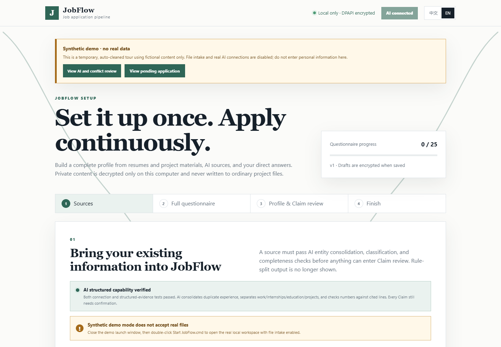

# JobFlow

JobFlow is a local-first, AI-centered job application workflow for Windows. It turns a resume, approved applicant facts, and an official job page into a reviewable application packet, then provides user-present browser assistance that stops before final submission.

> **Alpha software:** JobFlow does not claim universal ATS compatibility. Final Submit is always a trusted user action. Unknown external state is never retried automatically.



## What JobFlow does

1. Imports resumes and supporting material into Windows DPAPI encrypted storage.
2. Connects to an existing Hermes, OpenClaw, or supported loopback model without copying model credentials into the project.
3. Uses AI to reconstruct experience entities, preserve metrics, and produce source-grounded Claim candidates.
4. Collects one reusable Candidate Profile and Answer Bank, with explicit review for sensitive or missing facts.
5. Starts from an official company career page, verifies the job and approved ATS route, and builds one application review packet.
6. After one application-specific approval, fills approved values, attaches approved materials, and advances only through verified non-final controls while the user is present.
7. Stops at final review so the user can inspect the page and personally click Submit.
8. Lets the user save a local processing cadence, pause new intake, and explicitly process deferred local work without creating a background service or Windows scheduled task.

## Quick start on Windows

1. Download and extract the latest source ZIP.
2. Double-click `Install JobFlow.cmd` once.
3. Install **JobFlow Browser Companion** from Chrome Web Store or Microsoft Edge Add-ons when the installer opens its listing.
4. Double-click `Start JobFlow.cmd` for normal use.
5. If startup fails, run `Check JobFlow.cmd` and follow the first failed check.

The installer copies the application into a fixed, versioned directory under the current Windows account. Candidate data, queues, reports, and encrypted private material remain in a separate data directory, so the extracted download can be removed after installation. Running a newer installer upgrades the application without replacing that data; the Start menu also provides signed update, health check, rollback, and uninstall shortcuts.

Installed builds can check the fixed stable GitHub release channel only after the user clicks **Check for updates**. JobFlow accepts an update only when its canonical manifest is signed by the pinned release key and its source archive passes the signed hash, size, layout, and public-content boundary. A failed post-update health check restores the previous version. Source checkouts do not self-update and never replace their working tree.

To explore without private data, run `Start JobFlow Demo.cmd`. The demo uses fictional content, disables real AI and file intake, and removes its temporary state when closed.

See the [full quick start](docs/quickstart.md) for Browser Companion setup and recovery guidance.

## AI connections

JobFlow can reuse an already configured:

- Hermes or OpenClaw Agent on Windows or WSL;
- Ollama, LM Studio, LocalAI, llama.cpp, or vLLM loopback server;
- advanced command adapter through `JOBOPS_AI_COMMAND_JSON`.

An AI connection is accepted only after a structured capability test. Agent requests use an isolated, zero-tool channel. JobFlow does not extract, return, log, or persist API keys, tokens, cookies, executable paths, or model credentials.

## Safety boundaries

- Private applicant values remain behind `secure-ref:*` references and DPAPI encryption.
- Claims require source evidence and applicant approval before external use.
- Login, CAPTCHA, MFA, account creation, credentials, legal declarations, signatures, and unknown answers stop for the user.
- Final Submit, automatic retry, email, recruiter contact, and unattended scheduling are not implemented.
- `SUBMISSION_UNKNOWN` never triggers an automatic retry.
- Knowledge sources are read-only.

## Current support

| Capability | Alpha status |
|---|---|
| Windows install, signed update with rollback, health check, and bilingual local UI | Available |
| Encrypted onboarding, Candidate Profile, Answer Bank, and Claim review | Available |
| Existing Agent or loopback-model connection | Available with capability gate |
| Visible official-company job discovery and verified Apply routing | Available with user authorization |
| User-present company, Greenhouse, Lever, Workday, Ashby, and SmartRecruiters assistance | Bound routes only; live compatibility varies |
| Approved field fill and material attachment | Available per approved application |
| User-present local queue cadence, pause, and manual run | Available; every run requires a user click |
| Redacted diagnostics and optional local fixed-code incident history | Available; manual download only, no automatic transmission |
| Final submission or unattended operation | Not implemented |

Synthetic and saved-page tests are engineering evidence, not proof that every live ATS page is compatible.

## Development

```powershell
.\scripts\install-jobflow.ps1
.\.venv\Scripts\python.exe -m unittest discover -s tests
.\.venv\Scripts\python.exe -m jobops.public_release
```

The project is intentionally Windows-first because secure applicant storage uses DPAPI. Runtime state, databases, review packets, encrypted private files, and local release reports are excluded from the public repository.

## Documentation

- [Quick start](docs/quickstart.md)
- [Support](https://valerianxxx.github.io/JobFlow/support.html)
- [Browser Companion privacy](PRIVACY.md)
- [Architecture](docs/architecture.md)
- [Roadmap](docs/roadmap.md)
- [Release checklist](docs/release-checklist.md)
- [Security policy](SECURITY.md)
- [Contributing](CONTRIBUTING.md)
- [Changelog](CHANGELOG.md)

When reporting a problem, use **Privacy-safe incident history and support → Download diagnostics** in the local UI. The JSON contains only versions, states, counts, safety boundaries, and validated fixed error codes. Optional incident capture is off by default and keeps at most 32 local records when explicitly enabled. It does not include resume text, answers, Claim text, error messages, stack traces, URLs, local paths, credentials, tokens, or secure references, and JobFlow never transmits it automatically.

## License

[MIT](LICENSE)
