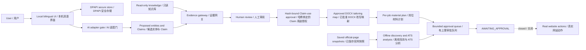

# JobFlow architecture / JobFlow 架构

JobFlow is a Windows-first local application plus an embedded Codex Skill. The browser UI is only a local control surface; private values are encrypted outside the project, while the repository contains code, schemas and synthetic evidence only.

JobFlow 是 Windows 优先的本地应用，并内嵌一个 Codex Skill。浏览器界面只是本机控制面；私人值在项目外加密，仓库只包含代码、Schema 与合成证据。

## Trust boundaries / 信任边界

| Boundary | Enforced behavior | 强制行为 |
|---|---|---|
| Private values | DPAPI outside the project; ordinary records keep opaque `secure-ref` only | 项目外 DPAPI；普通记录只存不透明 `secure-ref` |
| AI output | Entity completeness, provenance and grounding validation; format-only numeric equivalence and bounded same-sentence wraps are review-flagged, while calculations fail closed | 实体完整性、来源和依据校验；仅数字显示等价与同句有限换行可带标记进入审阅，计算仍失败关闭 |
| AI readiness | Synthetic full-contract test before private intake; handshake alone is insufficient | 私人资料接入前通过合成全契约测试；简单握手不算就绪 |
| Per-job materials | One immutable approved master; arbitrary DOCX files require an explicit safe-tailoring map; conditional Cover Letter and portfolio/link bindings | 同一不可变母版；普通 DOCX 必须先建立明确安全改写映射；求职信与作品集/链接按字段需要生成或绑定 |
| Personal claims | Always proposed first; material use requires a separate approval bound to exact wording, profile, master and onboarding revision | 始终先作为候选；用于材料前须单独批准，并绑定精确措辞、Profile、母版与资料版本 |
| Knowledge | Read-only fingerprints and zero-write verification | 只读指纹与零写入验证 |
| Job discovery | Saved company/ATS HTML or Greenhouse/Lever JSON only; no live freshness claim | 只读已保存官网/ATS HTML 或 Greenhouse/Lever JSON；不声称实时有效 |
| Browser/ATS | Opaque field plans and zero-modification fake adapter | 不透明字段计划与零修改假适配器 |
| Queue | Transactional capacity and FIFO deferred intake | 事务容量与延后任务 FIFO |
| External actions | Production transport absent and fail-closed | 生产传输不存在且失败关闭 |

## Main packages / 主要模块

- `onboarding_center`, `onboarding_server`, `ui/`: bilingual one-time profile and Claim review.
- `ai_runtime`, `ai_connections`, `source_quality`, `onboarding_extraction`: capability-tested local/Agent AI connection and multi-mode extraction quality gates.
- `secure_store`, `private_onboarding`, `resume_onboarding`, `external_claims`, `resume_tailoring`, `application_readiness`: DPAPI lifecycle, Master Resume designation, exact Claim-use approval, applicant-approved paragraph mappings and redacted local-readiness reporting.
- `knowledge`, `claims`, `claim_registry`, `evidence`: read-only evidence and approval lifecycle.
- `official_discovery`, `sourcing`, `ats_browser`, `ats_capabilities`: offline official-source and ATS safety framework.
- `application_materials`, `orchestrator`, `queue_manager`, `continuous_intake`: one-master per-job material planning and content-bound processing to the bounded review queue. Both the synthetic tour and a completed DPAPI-backed user profile use this same offline pipeline; the latter accepts only explicit local snapshots and current applicant approvals.
- `application_execution`: hash-bound six-step runbook for freshness, guest entry, prefill, upload, protected questions and final submission; every step remains planning-only until its exact approval boundary is separately enabled.
- `public_release`, `release_candidate`, `release`: current-tree/history privacy gates and release evidence.

Every persisted transition is content-bound or auditable. `SUBMISSION_UNKNOWN`, CAPTCHA, MFA, OTP, login and account creation do not have an automatic continuation path.

每个持久化状态迁移都有内容绑定或审计记录。`SUBMISSION_UNKNOWN`、CAPTCHA、MFA、验证码、登录和账号创建均无自动继续路径。
